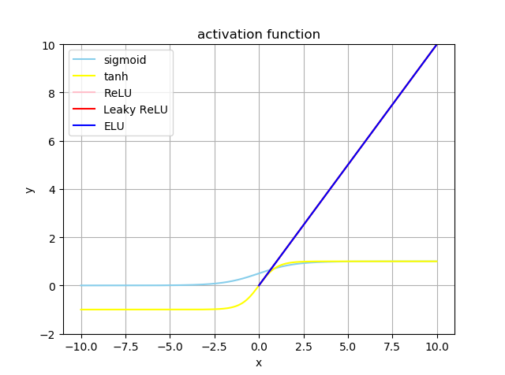

[TOC]

# chapter 2

---

### 2.1

**多层感知机和感知机的区别是什么？为什么会有这样的区别？**

从直观而言，感知机和多层感知机的主要区别在于有没有隐层，从上世纪八九十年代而言，常用的多层感知机就是浅层神经网络，包括了一个隐层，从数学的角度去分析，那么对于感知机模型，其具体为：
$$
H(x) = \alpha(w^Tx + b) 
$$
而对于多层感知机而言，由于其具有相应的隐层，那么其可以表示更复杂的数学模型。但是由于最初的时候，由于计算力较差，且K.Hornik证明了理论上只有一个隐层的浅层神经网络足以拟合出任意的函数，所以早期的多层感知机也主要是用浅层的感知机模型。 

最早的感知机模型只有一个神经元，只有输入和输出，没有隐层，也没有复杂的激活函数，因此无法解决非线性可分问题。 

### 2.2

**假设有一个只有1个隐层的多层感知机，其输入、隐层、输出层的神经元个数分别为33,、512、10，那么这个多层感知机中总共有多少个参数是可以被训练的？**

根据相应的计算，其具体包括了相应的weight 和 bias ，所以为：
$$
N = 33\times512 + 512 + 512\times 10 + 10 = 22528
$$

### 2.3

### 2.4

**请在同一个坐标系内画出五种不同的激活函数图像，并比较它们的取值范围**

实现如下五种激活函数： `sigmoid`,`tanh`,`ReLU`,`Leaky ReLU`,`ELU`

其具体实现代码可以参考：[2_4.py](2_4.py)

