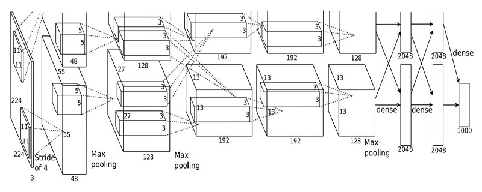
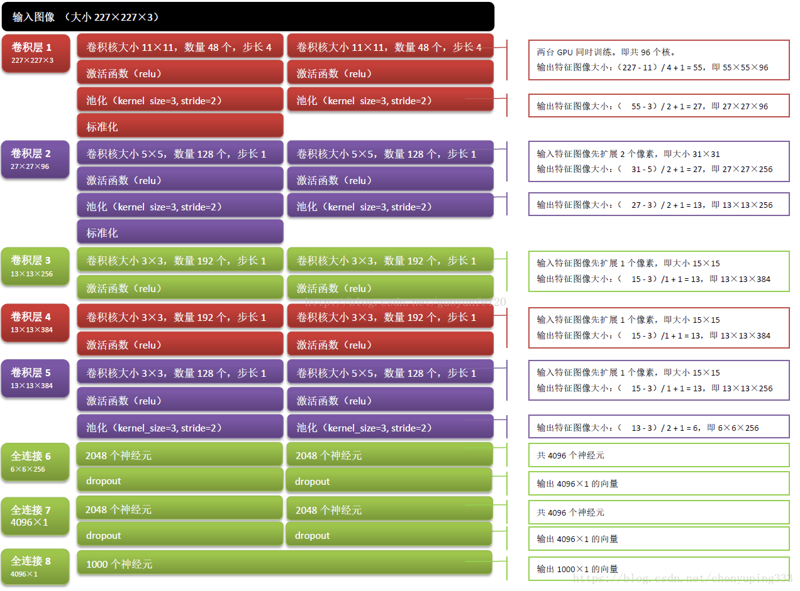
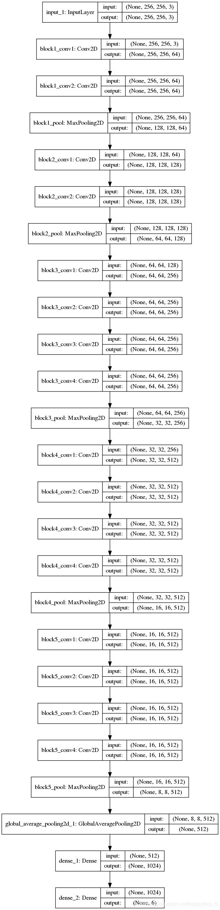
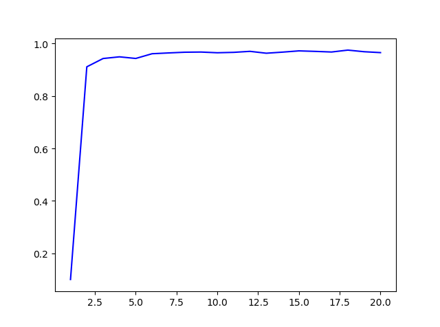

[TOC]

# chapter 3

---

### 3.1

计算AlexNet，VGG19，ResNet152三个网络中的神经元数目及可训练的参数数目

#### AlexNet

其具体为：

由于使用了两个GPU进行训练，那么对于每一层的相应计算应该分别为（计算weights,bias = input_channel * output_channel * 2（其它网络不需要*2））：

**第一层：**$2\times 11\times 11\times 3\times 48 =34848 $

**第二层：**$2\times 5\times 5\times 48\times 128 = 307,200‬$

**第三层：**$2\times 3\times 3\times 256\times 192 = 2\times442,368‬$

**第四层：** $2\times 3\times 3\times 192\times 192 = 663,552$

**第五层：**$2\times 3\times3 \times 192\times 128 = 442,368$

**第六层：**$2\times 13\times 13\times 128 \times 2048 = 88,604,672‬$

**第七层：**$2\times 2048\times 2048 = 8,388,608‬$

**第八层：**$2\times 2048\times 1000 = 4,096,000‬$

根据此可以计算到相应训练的参数数目，神经元数目也很容易计算得到。 

对于其他两个网络，也可以很容易的计算到，只需要参考如下的网络结构图：

ResNet152的网络结构可以参考： https://blog.csdn.net/SPESEG/article/details/103087880

### 3.10

在MNIST数据集上训练一个多层感知机网络，网络规模拓扑可自定义，要求模型精度达到95%以上

如果使用简单的多层感知机模型，模型精度很难达到95%，而且非常容易过拟合，建议使用dropout 或者其它的一些正则化方法来防止过拟合，主要可以设置初始的参数所在范围；除此之外，如果搭建一个卷积神经网络模型则很容易能够达到极高的精度，可以参考给出的CNN的代码。

MLP最终能达到97%左右的精度：

